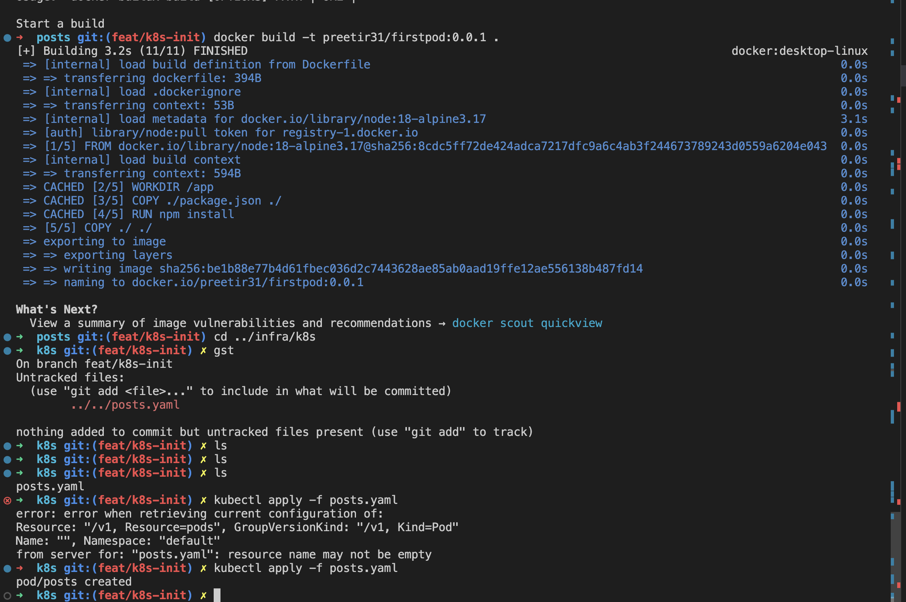
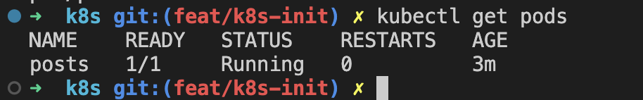
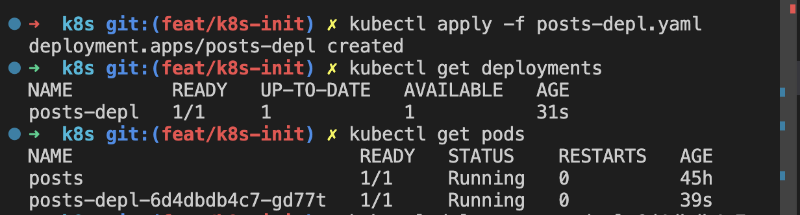

# 1  Creating first pod
- docker build -t preetir31/firstpod:0.0.1 .
- kubectl apply -f posts.yaml (from within the home directory of yaml file)

# 2 To check runing pods
- kubectl get pods
Ready - copies to be executes/copies successfullly running
 

# 3 Creating a deployment
