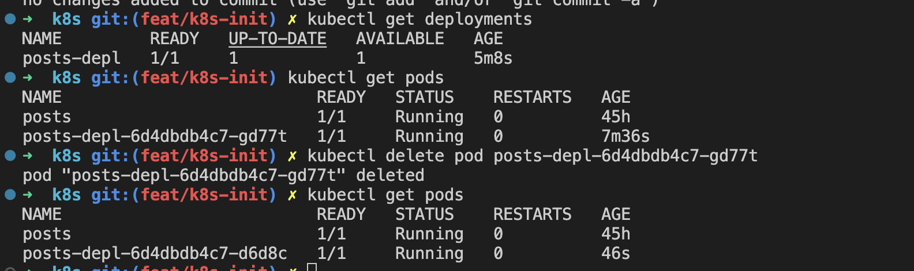
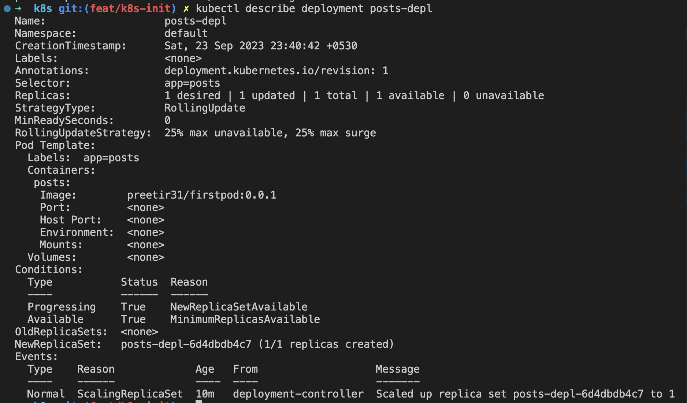

# 1  Creating first pod
- docker build -t preetir31/firstpod:0.0.1 .
- kubectl apply -f posts.yaml (from within the home directory of yaml file)

# 2 To check runing pods
- kubectl get pods
Ready - copies to be executes/copies successfullly running
 

# 3 Creating a deployment

- kubectl get deployments  - get all running deployments on the cluster
- kubectl get deployments - pods running on cluster
One pod is automatically created by deployment as replica = 1

- kubectl delete pod podname - delete pod
deleting deployment pod automatically creates a new pod

- kubectl describe deployment depname

- kubectl apply -f configfileName - create a deployment from a config file

- kubectl delete deployment depname - deletes all pods as well
